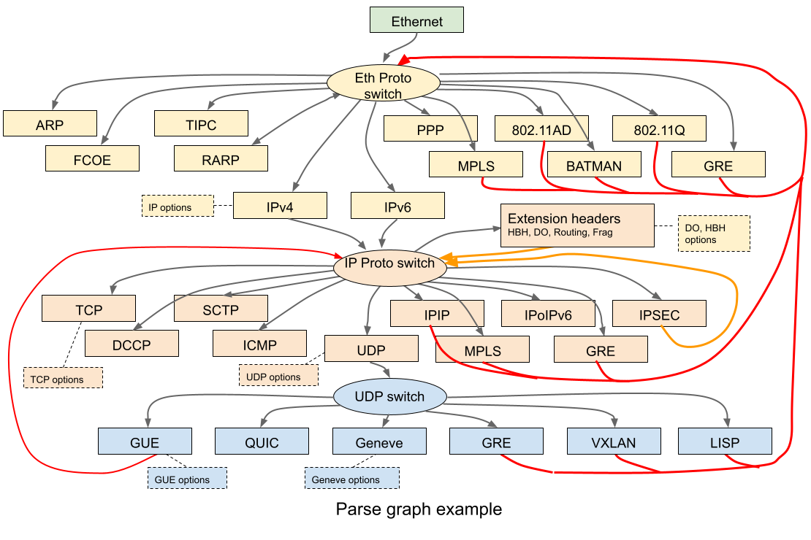
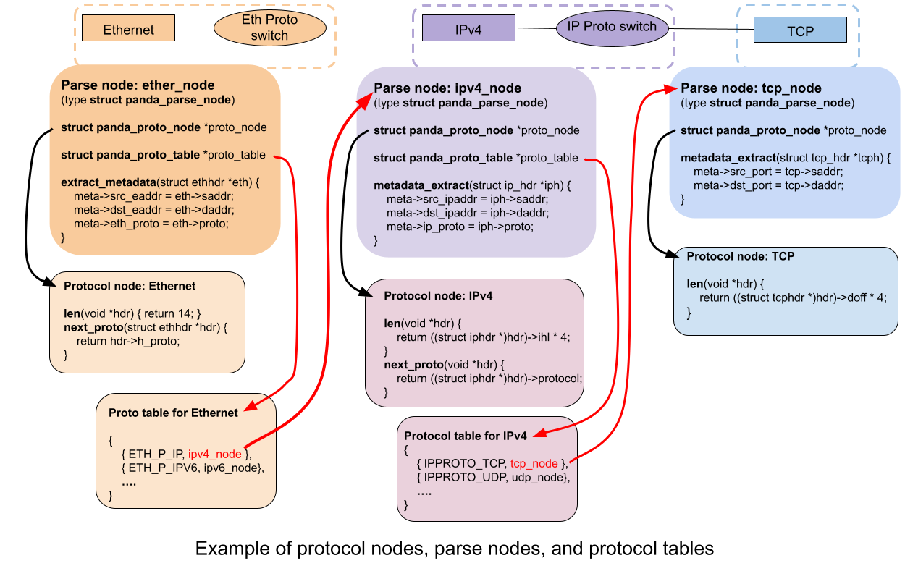
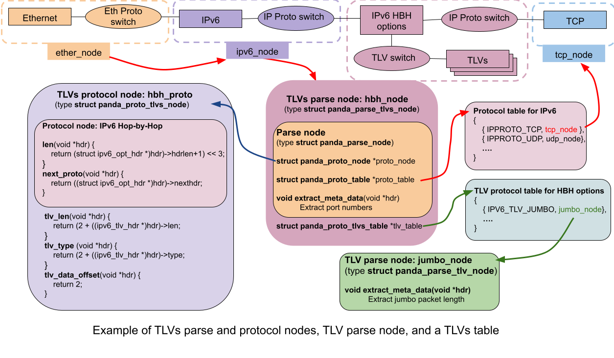
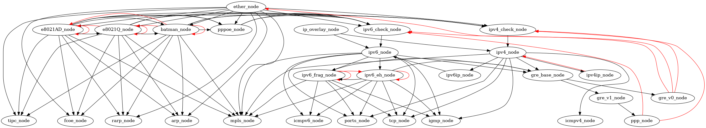
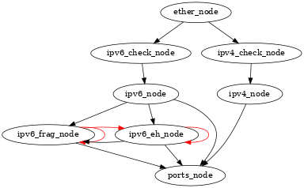

The PANDA Parser
================

The PANDA Parser is a framework and API for programming protocol parsers.
Protocol parsing is a fundamental operation in network processing and is best
programmed via a declarative representation instead of a traditional imperative
representation as a sequence of instructions. In PANDA, a parser is defined by
a set of data structures and embedded functions that instantiate a customizable
parse graph for a particular use case. The PANDA Parser is supported in the
PANDA library that contains open APIs allowing a developer to build customized
parsers for a variety of arbitrary protocols.

# Architecture

A key observation concerning protocol parsing is that it is best modeled as a
declarative structure as opposed to an imperative program. The PANDA Parser
employs such a structure as a parse graph where each node describes a protocol
and includes the attributes and operations for processing that protocol. The
manifestation of a *parse graph* in the PANDA Parser is a well defined tree
data structure in C or C++. When a packet, or more generally Protocol Data Unit
(PDU) or data object, is processed the parser engine is invoked to "walk the
parse graph". The nodes of the parse graph include callout functions for
custom, per protocol processing. An efficient software implementation can be
elicited by an optimizing compiler that is aware of the PANDA Parser data
structure, and the PANDA Parser is amenable to hardware acceleration by mapping
data structures and operations to hardware mechanisms and functions. An example
of protocol parse graph is show below.

The fundamental data structures of the PANDA parser are:
 * **Protocol nodes**
 * **Parse nodes**
 * **Protocol tables**
 * **Parsers**

A **protocol node** provides the properties and functions needed to parse one
protocol to proceed to the next protocol in the parse graph for a packet. A
parse node contains common characteristics that reflect the standard protocol
definition (for instance there is only one standard procedure to determine the
length of an IP header). The parse walk over a protocol node requires two key
pieces of information: the *protocol type* of the next node and the *length* of
the current protocol header. A protocol node has two corresponding functions
that are implemented per a specific protocol:

* **len**: Returns the length of the current protocol layer (or protocol header)

* **next_proto**: Returns the protocol type of the next layer

A **parse node** is an instantiation of one node in the parse graph of a parser
being defined. A parse node includes a reference to the protocol node for the
specific protocol, as well as customizable processing functions. A parse node
allows defining two optional custom processing functions:

* **extract_metadata**:  Extract metadata, e.g. protocol fields, from a
protocol header and save it in the metadata memory

* **handle_proto** : Perform arbitrary protocol processing. This function might
implement the full logic of protocol processing of some protocol

A **protocol table** is a lookup table that takes a protocol number as input
as the protocol type of the next protocol layer, and returns the parse node
for the next layer. The protocol numbers can be the canonical protocols
numbers, for instance a protocol number might be an IP protocol number where
the table contains parse nodes for various IP protocols (e.g. for TCP, UDP,
etc.). Non-leaf parse nodes have a reference to a corresponding protocol table,
for instance, a parse node for IPv6 would refer to a protocol table that takes
an IP protocol number as input and returns the parse node for the corresponding
IP protocol.

A **parser** defines a parser and includes a set of parse nodes, each having a
reference to a protocol node. Non-leaf parse nodes have a reference to a
protocol table. The parse nodes are connected to be a graph via the
relationships set in the protocol tables. The parser can be represented as a
declarative data structure in C and can equivalently be viewed as a type of
Finite State Machine (FSM) where each parse node is one state and transitions
are defined by next protocol type and associated protocol tables. A parser
defines a **root node** which is the start node for parsing an object (for
networking the root is typically Ethernet).

# Samples

Several functions, data structures, helper macros, and programming techniques
are demonstrated in the example code in **samples/simple_parser**.

# Core protocol parser

The primary data structures for the PANDA Parser are define in
**panda/include/parser.h**. They are:

* **struct panda_proto_node**: Data structure for a protocol node. Members
include operations to get length of current header and to get the protocol
of the next header.

* **struct panda_parse_node**: Data structure for a parse node. Members include
operations to extract metadata and perform per protocol processing. A parse node
references a protocol node for the specific protocol.

* **struct panda_proto_table**: Data structure that contains a protocol
table. A protocol table is composed of an array of type and parse node pairs.

* **struct panda_parser**: Data structure defining on instance of a parser.
The key member is the *root node* of the parser which is the parse node at
which parsing commences for a data object.

* **struct panda_metadata**: Data structure containing metadata. This describes
the common metadata fields and would be immediately followed by an array of
user created metadata frames (see below).

## Parser data structure helpers

There are number of helper macros to create a parser and its corresponding
data structures:

* **PANDA_MAKE_PARSE_NODE(PARSE_NODE, PROTO_NODE, EXTRACT_METADATA, HANDLER,
UNKNOWN_NEXT_PROTO, PROTO_TABLE)**

  Creates a parse node as a **static const struct panda_parse_node**. The
  arguments to the macro include the name of the parse node (**NAME**), the
  corresponding protocol node (**PROTO_NODE**), an extract metadata function
  (**EXTRACT_METADATA**), a function to process the protocol layer (**HANDLE**),
  a function to call in case of no next protocol found (**UNKNOWN_NEXT_PROTO**),
  and a protocol table for transitioning to the next node in the parse walk
  (**PROTO_TABLE**). The functions of the parse node cannot be NULL, a set of
  default functions are provided in cases where these functions aren't of
  interest to customize:

	* **panda_null_extract_metadata**: No-op function to extract metadata

	* **panda_null_handle_proto**: No-op function to process a protocol

	* **panda_unknown_next_proto_fail** or
	  **panda_unknown_next_proto_ignore**: Default functions to either
	  treat an unknown next protocol as a failure or ignore it and return
	  success (in either case, for an unknown next protocol parsing stops)

* **PANDA_MAKE_LEAF_PARSE_NODE(PARSE_NODE, PROTO_NODE, EXTRACT_METADATA,
HANDLER)**

  Creates a leaf parser node where there is no next protocol and no protocol
  table associated with the parse node. The semantics of the arguments
  are the same as the similarly named ones of **PANDA_MAKE_PARSE_NODE**.

* **PANDA_MAKE_PROTO_TABLE(NAME, ...)**

  Creates a protocol table containing a variable list of entries as a **static
  const struct panda_proto_table**. The arguments consist of the name of the
  table (**NAME**) and a variable list of pairs in the form
  { *NUMBER, PARSE_NODE* }.

* **PANDA_PARSER(PARSER, NAME, ROOT_NODE)**

  Creates a parser as **struct panda_parser**. The macro arguments include the
  name of the parser structure (**PARSER**), a text name of the parser for
  debugging (**NAME**), and the root node (**ROOT_NODE**) that is a pointer to a
  **struct panda_parse_node**.

## Return codes

Various PANDA related functions return a PANDA return code. The current return
codes are:

* **PANDA_OKAY**
* **PANDA_STOP_OKAY**
* **PANDA_STOP_FAIL**
* **PANDA_STOP_LENGTH**
* **PANDA_STOP_UNKNOWN_PROTO**
* **PANDA_STOP_ENCAP_DEPTH**
* **PANDA_STOP_UNKNOWN_TLV**
* **PANDA_STOP_TLV_LENGTH**

**PANDA_OKAY** indicates that the operation succeeded and that parsing may
continue. **PANDA_STOP_OKAY** indicates that parsing stopped normally without
an error. The other error codes, prefixed by **PANDA_STOP_**, indicate that
an error was encountered and parsing stopped or should stop.

## Invoking the PANDA Parser

A defined parser is invoked by:

**int panda_parse(const struct panda_parser \*parser, const void \*hdr, size_t
len, struct panda_metadata \*metadata, unsigned int flags, unsigned int
max_encaps)**

where **parser** is the parser to use, **hdr** is a pointer to the first byte of
the object being parsed, **len** is the byte length of the object,
**metadata** is the metadata structure in which layers can write metadata,
**flags** is a set of flags (see **src/include/panda/parser.h**), and
**max_encaps** indicates the maximum number of encapsulations that can be
parsed.  **panda_parse** returns a PANDA return code, **PANDA_STOP_OKAY** is
returned if no error was encountered, else an appropriate error code is
returned.

## Common protocol nodes

The PANDA Parser defines a number of common protocol nodes. There definitions
can be found in **src/include/panda/proto_nodes**. The protocol nodes for common
protocols are named **proto_NAME** where **NAME** is a protocol like IPv4, IPv6,
TCP, UDP, etc. All common protocol nodes can be defined by including
**src/include/panda/proto_nodes_def.h**. Note when this header is included the
various protocol nodes are defined as **static const struct panda_proto_node**
structures (i.e. these protocol nodes definitions are not global but restricted
to a compilation to facilitate compiler optimizations).

## Metadata

Metadata is ancillary data concerning a data object that is collected as a
data object proceeds through a pipeline. Each protocol layer may write
metadata corresponding to its protocol. Typically, metadata is simply taken
from fields in a packet that are copied to fields in the metadata structure
intended to hold the data for the field in a protocol header. The metadata
structure passed to the **panda_parse** function is composed of a
**struct panda_metadata** followed by one or more user defined
*metadata frame* structures.

A metadata frame contains the metadata corresponding to a set of protocol
layers for a logical group within processing. The canonical example of this
is encapsulation in networking, where a packet may have several layers of
encapsulation and for each encapsulation an associated set of metadata might
include IP address, protocols, and transport port numbers.
**struct panda_metadata** includes the maximum number of frames, frame size,
and number of encapsulations which serves as the index to the current metadata
frame. The number of encapsulations is initialized to zero in **panda_parse**.
When an encapsulating protocol is encountered, as indicated by an attribute of
a protocol node, the number of encapsulations is incremented and subsequent
metadata is written to the next frame. If the number of encapsulations exceeds
the maximum number of metadata frames, then the last frame is used and data
from the previous frame is overwritten. A common configuration might be to
employ two frames to get metadata for the outermost headers and headers of the
innermost encapsulation.

The metadata frame structure for a parser is user defined, but for convenience,
**parser_metadata.h** includes a number of canned metadata definitions and
metadata extractions functions to extract the data. A developer can pick and
choose amongst the definitions and functions for their own purposes and may also
create their own custom metadata fields and extraction functions. Canned
metadata fields have the form **PANDA_METADATA_XX**, where the **XX** is a
field name such as **eth_proto, addrs, ports**. Metadata extraction functions
for canned metadata can be created by using metadata function templates
in **parser_metadata.h**. Common metadata extraction function templates have the
form **PANDA_METADATA_TEMP_XX(NAME, STRUCT)** where **XX** describes the data
being extracted (e.g. **ipv4** for IPv4 extracting fields), **NAME** is the
name of the function created and can be used as the **EXTRACT_METADATA**
argument in **PANDA_MAKE_PARSE_NODE**, and **STRUCT** is the metadata frame
structure (which again is user defined). The function templates expect certain
common metadata fields to be present in the metadata frame structures (see
comments with function templates in **parser_metadata.h** to see what metadata
fields are required by a template).

# Parsing TLVs

*Type-Length-Value* tuples (*TLVs*) are a common networking protocol construct
that encodes variable length data in a list. Each datum contains a Type to
discriminate the type of data, a Length that gives the byte length of the data,
and a Value that is the bytes of data. TLVs are parsed in the context of a top
level protocol, for instance TCP options and IPv4 options are represented by
TLVs parsed in the context of a TCP header and IPv4 header respectively.

## Data structures

A **TLVs protocol node**, with data structure **struct panda_proto_tlvs_node**,
(note plural TLVs) is an extended protocol node that describes a protocol that
includes TLVs. A TLVs protocol node provides the properties and functions to
parse TLVs in the context of a top level protocol and includes three operations:
**tlv_len**, **tlv_type**, and **tlv_data_offset**. The **tlv_len** function
returns the length of a TLV (and therefore the offset of the next TLV),
**tlv_type** returns the type of a TLV, and **tlv_data_offset** returns the
offset of the data within a TLV. Note that **tlv_len** returns the length of
the whole TLV including any TLV header, so the length of just the data in a TLV
is the total length of the TLV as given by **tlv_len** minus the offset of the
data as given by **tlv_data_offset**.

A **TLVs parse node**, with data structure **struct panda_parse_tlvs_node**,
(again note plural TLVs) is an extended parse node that has references to a
TLVs protocol node and a TLVs table. Besides the common parse node operations,
there are two TLV specific operations: **post_tlv_handle_proto** and
**unknown_type**. **post_tlv_handle_proto** is called after TLV processing has
been performed to do protocol processing (note **handle_proto** in the parse
node is called before TLV processing). **unknown_type** is called if a TLV type
is not matched in the table or **check_length** for a specific TLV fails.
**unknown_type** can return failure to indicate an error and stop parsing, or
**PANDA_OKAY** which means to skip the TLV and proceed to process the next one
in the list.

A **TLV table**, with data structure **struct panda_proto_tlvs_table**, is a
lookup table that takes a TLV type as input and returns a TLV parse node for
a TLV.

A **TLV parse node**, with data structure **struct panda_parse_tlv_node**,
(note the singular TLV) describes the processing of one type of TLV. This
includes three optional operations: **check_length**, **extract_metadata**, and
**handle_tlv**. **check_length** is used to check the length of TLV data
corresponds to what is expected by a specific TLV type, **extract_metadata**
extracts specified data from the TLV to the metadata structure, and
**handle_tlv** performs arbitrary processing of the TLV.

## TLV parser helpers

There are number of helper macros for parsing TLVs:

* **PANDA_MAKE_TLVS_PARSE_NODE(PARSE_TLVS_NODE, PROTO_TLVS_NODE,
EXTRACT_METADATA, HANDLER, UNKNOWN_NEXT_PROTO, UNKNOWN_TLV_TYPE,
POST_TLV_HANDLER, PROTO_TABLE, TLV_TABLE)**

  Creates a parse node (**as a static const struct panda_parse_tlvs_node**).
  The arguments to the macro include the name of the parse node
  (**PARSE_TLVS_NODE**), the corresponding TLVs protocol node
  (**PROTO_TLVS_NODE**), extract metadata function (**EXTRACT_METADATA**),
  function to process the protocol (**HANDLE**), a function to call in case of
  no next protocol found (**UNKNOWN_NEXT_PROTO**), function to call if TLV type
  is not found (**UNKNOWN_TLV_TYPE**), function to perform protocol processing
  after TLVs have been processed (**POST_TLV_HANDLER**), protocol table for
  transitioning to the next node in the parse walk (**PROTO_TABLE**), an TLV
  table for looking up a TLV parse node from TLV type (**TLV_TABLE**). The
  functions of the parse node can not be NULL, a set of default functions are
  provided in cases where these functions aren't of interest to customize:

	* **panda_null_tlv_extract_metadata**: No-op function to extract
	  metadata

	* **panda_null_tlv_extract_metadata**: No-op function to process a
	  protocol

	* **panda_unknown_tlv_fail** or
	  **panda_unknown_tlv_ignore**: Default function to either
	  treat an unknown TLV as a failure (stop parsing) or ignore it and
	  return success (skip the TLV and proceed to the next one)

* **PANDA_MAKE_LEAF_TLVS_PARSE_NODE(PARSE_TLV_NODE, PROTO_TLV_NODE,
EXTRACT_METADATA, HANDLER, POST_TLV_HANDLER, TLV_TABLE)**

  Creates a leaf TLVs parser node, that is there is no next protocol and
  not protocol table associated with the parse node. The semantics of the
  macro arguments are the same as the similarly named ones in
  **PANDA_MAKE_TLVS_PARSE_NODE**.

* **PANDA_MAKE_TLV_TABLE(NAME, ...)**

  Creates a TLV table containing a variable list of entries (as a **static
  const struct panda_proto_tlvs_table**). The arguments consist of the name of
  the table (**NAME**) and a list of pairs in the form { *TYPE, TLV_NODE* }.

* **PANDA_MAKE_TLV_PARSE_NODE(NODE_NAME, CHECK_LENGTH, METADATA_FUNC,
HANDLER_FUNC)**

  Create a TLV parse node for processing a single TLV type. Arguments are name
  for the structure (**NODE_NAME**), function to check the length of the data
  for the specific type (**CHECK_LENGTH**), function to extract metadata
  (**METADATA_FUNC**), and TLV processing function (**HANDLER_FUNC**).

# Parsing flag-fields

*Flag-fields* are a common networking protocol construct that encodes optional
data in a set of flags and data fields. The flags indicate whether or not a
corresponding data field is present. The data fields are fixed length and
ordered by the ordering of the flags indicating the presence of the fields.
Examples of protocols employing flag fields are GRE and GUE.

The pertinent structures for flag-fields in the PANDA parser are:

* **struct panda_flag_field**: describes the format of one flag-field. The
members of this structure include the **flag** bits, the **mask** to apply to a
set of flags, and a **size** which is the byte size of the corresponding field.
A flag field is matched in a set of flags if ((flags & fs->mask) == fs->flag) where fs is a pointer to a flag-field structure.

* **struct panda_flag_fields**: contains an array of flag-field structures
that describe the set of flag-fields for some protocol.

Functions to process and parse flag fields are:

* **size_t panda_flag_fields_length(__u32 flags, const struct panda_flag_fields
\*flag_fields)**

  Return the length of all the fields for some set of **flags**. This function
  is commonly used to determine the variable length of a protocol header that
  contains flag-fields.

* **ssize_t panda_flag_fields_offset(__u32 targ_idx, __u32 flags, const struct
panda_flag_fields \*flag_fields)**

  Returns data field offset for a flag as determined by the flags set in
  **flags**. **idx** identifies the flag being tested as an index into the
  table in **flag_fields**.

* **__uNN panda_flag_fields_getNN(const __u8 \*fields, __u32 targ_idx,
__u32 flags, const struct panda_flag_fields \*flag_fields)**

  Function to get the value of the data field for some flag. **NN** indicates
  the return type in a number of bits and can be 8, 16, 32, or 64. **fields**
  is a pointer to the fields data in the object, **targ_idx** refers to the
  flag being queried and is an index in the **flag_fields table**. **flags**
  are the flags from the object being parsed.

# Flow hash

It is common for network devices to classify packets per the logical flow that
they belong to. For instance, a device may want to classify packets that are
part of the same TCP connection for the purposes of load balancing in ECMP
(Equal Cost MultiPath) or RSS (Receive Side Scaling). The common method to
classify packets is to perform a hash over the fields in a packet that identify
its flow. This is typically a "tuple hash", for instance over the 5-tuple
of protocol (e.g. TCP), source address, destination address, source port,
and destination port.

In PANDA, a flow hash can be derived from the fields in a metadata frame
structure that contain the flow identification. These fields can be placed in
the metadata frame structure such that they are contiguous and the hash
function only needs to take as input the pointer to the first byte to hash and
the length of bytes to hash.

There are two utility functions in **parser.h** to assist with flow hashing
metadata:

* **__u32 panda_compute_hash(const void \*start, size_t len)**

  Takes these two arguments which are the start pointer and length of data
  to hash. The function calls **siphash** to perform the hash over the bytes,
  and returns the (non-zero) hash value.

* **PANDA_COMMON_COMPUTE_HASH(METADATA, HASH_START_FIELD)**

  Helper macro to compute a hash from a metadata frame structure. **METADATA**
  is a pointer to a metadata frame structure and **HASH_START_FIELD** is the
  offset within the structure to start the hash. This macro requires that the
  common metadata for IP addresses is defined in the metadata frame structure,
  that is there is an addrs field of type **PANDA_METADATA_addrs** in the
  structure. The end offset of the hash area is the last byte of the addrs
  structure which can be different depending on the type of address (for
  instance, IPv6 addresses have more bytes than IPv4 addresses so the length of
  the bytes hashed area
  will be greater).

# Built in parsers

The PANDA Parser includes some built in parsers:

## Big parser

**panda_parser_big_ether** and **panda_parser_big_ip** are the "big" parsers.
Theses parsers parse and extract common canned metadata for all the common
protocols defined for the PANDA parser (corresponding to the protocols of the
common protocol nodes). The "ether" variant parses an Ethernet packet and the
protocol node of the root parse node is **panda_parse_ether**. The "ip" variant
parses an IP packet and the protocol node of the root parse node is
**panda_parse_ip** (the next protocol function is a switch on IP version fields
to determine if protocol is IPv4 or IPv6). The metadata frame structure for the
big parser is **panda_metadata_all** and it contains all the defined canned
metadata fields. The parser parses and extracts the canned metadata from all
the common protocols defined in the PANDA parser. For convenience, there are
some front-end functions that can be called to parse packets in various
scenarios:

* **bool panda_parser_big_parse_ether(void \*p, size_t len,
struct panda_parser_big_metadata \*mdata)**

  Parse packet starting with Ethernet header

* **bool panda_parser_big_parse_l3(void \*p, size_t len, __be16 proto,
struct panda_parser_big_metadata \*mdata)**

  Parse packet starting with IP header. Root node distinguished based on IP
  version number

* **__u32 panda_parser_big_hash_ether(void \*p, size_t len)**

  Return hash for a packet starting with Ethernet header

* **__u32 panda_parser_big_hash_l3(void \*p, size_t len, __be16 proto)**

  Return hash for a packet starting with the indicated layer 3 protocols
  (i.e. an EtherType)

* **__u32 panda_parser_big_hash_ip(void \*p, size_t len)**

  Return hash for packet starting with in IP header header (IPv4 or IPv6
  distinguished by inspecting IP version number)

In the above functions, **p** is a pointer to the first byte of a packet
and **len** is the length of the packet. **mdata** contains the metadata
and has type **struct panda_parser_big_metadata**. The structure contains
a metadata frame structure **struct panda_metadata_all** as the parser defined
metadata structure.

The graph of big parser as generated by [panda-compiler](panda-compiler.md) is
below:

## Simple hash parser

**panda_parser_simple_hash_ether** is the simple Ethernet hash parser. This
parser is primarily is used to produce a flow hash. The metadata frame
structure for this parser is **panda_parser_simple_hash_metadata** and contains
address and ports canned metadata fields. The parser parses and extracts
addresses from IPv4 and IPv6, parses over IPv6 extension headers to locate the
transport protocol layer. If the transport protocol is TCP, UDP, SCTP, or DCCP
the transport ports are extracted in metadata. A hash is computed from a packet
using function:

  **__u32 panda_parser_hash_hash_ether(const void \*p, size_t len)**

  where **p** is a pointer to the first byte of the Ethernet packet and **len**
  is the length of the packet.

The graph of simple hash parser as generated by
[panda-compiler](panda-compiler.md) is below:

# The panda-compiler

The **panda-complier** is PANDA aware program that interprets a C file
containing a PANDA parser and produces C code that is an optimized version.
The output C code is then compiled to produce a binary. See
[panda-compiler](panda-compiler.md) for more information.
