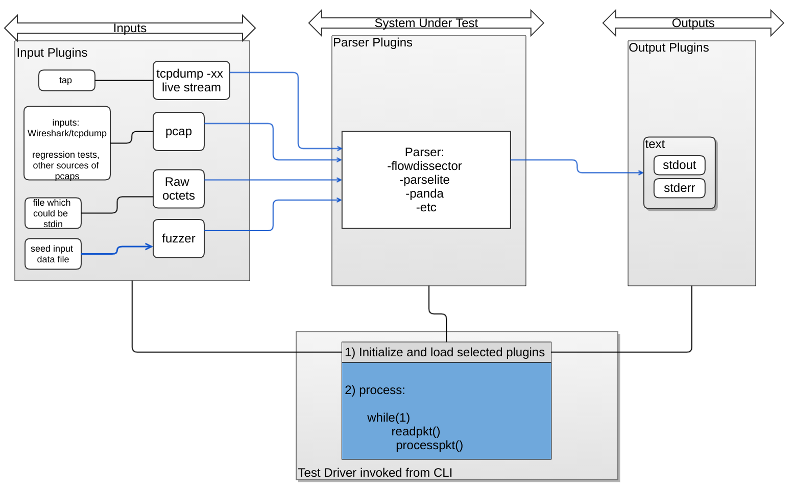

Parser test
===========

The PANDA parser test is and executable and set of tests for testing the
PANDA parser, as well as flowdis and parselite parsers.

# Directory

The directory src/test/parser contains the parser testing infrastructure.

# Building

The test parser executable (*test_parser*) is built as part of the top level
make (build from src directory as describe [here](../README.md).

# Architecture And Usage

This infrastructure works by matching up three pieces:
 1) an input method which reads input packets, converting them into an
    internal data buffer (using -i on the command line)
 2) a core method which parses the data buffer into dissected-packet structures
    (using -c on the command line)
 3) an output method which outputs the dissected-packet structures in some form
    (using -o on the command line).

running 'test_parser -h' will show:

-i NAME[,ARGS]

        Use input method NAME; ARGS is an optional string which is
        passed to the input method, which will presumably use it.
        If NAME is `list', lists possible input methods (to stdout).
        If NAME is `help', gives help on method named ARGS, as in
        `-i help,tcpdump`

        For `list' and `help', does not start after printing.

-o NAME[,ARGS]

        Use output method NAME; ARGS is an optional string which is
        passed to the output method, which will presumably use it.
        If NAME is `list', lists possible output methods (to stdout).
        If NAME is `help', gives help on method named ARGS, as in
        '-o help,text'

        For `list' and `help', does not start after printing.

-c NAME[,ARGS]

        Use computation core NAME; ARGS is an optional string which is
        passed to the core module, which will presumably use it.
        If NAME is `list', lists possible cores (to stdout).
        If NAME is `help', gives help on core named ARGS, as in
        '-o help,flowdis'

        For `list' and `help', does not start after printing.

The currently define computation cores are:

* **panda**
* **flowdis**
* **parselite**

There are two other options:

-n N

	This specifies a number of times to process each packet. The
	default is 1.

-N

	This specifies that the actual call to the parser is to be
	suppressed, but all the surrounding infrastructure is to run.
	This allows subtracting off the cost of the infrastructure to
	get the cost of the parser proper. As will be seen later using
	this option helps us quantify the cost of a specific parser's
	overhead.

-H

	Compute/print metadata hashes. Uses siphash algorithm to calculate
	a tuple hash over fields metadata structure returned by a parser
	that identify a flow. It is expected that for the same packet, the
	smae hash value is returned by the PANDA Parser, flowdis, and
	parselite when running the test.

## Discovering Interfaces

The interface is discoverable; for example, you can use *-i list* to get
a list of the supported input methods. For example,

$ ./test_parser -i list

tcpdump
raw
pcap
fuzz

and to get more info on one of those, you can use the `help'
pseudo-method:

$ ./test_parser -i help,tcpdump

For `tcpdump' input, if ARGS is not given, or if ARGS is `-', stdin
is read.  Otherwise, ARGS is opened as a file and input is read from
there.

Input format is tcpdump -xx output.

## Inputs

$ ./test_parser -i list

tcpdump
raw
pcap
fuzz

Do a help on each to get more details.

tcpdump input is useful mostly when what you have is packet data in
text form, in tcpdump -xx format.

The raw input is designed for handling synthetic data; it deliberately
has minimal framing, just barely enough to separate the input into
distinct packets.

The fuzz input is designed for use with the AFL fuzzer; it's like raw
but without the framing, handling only one packet per run.  (This turns
out to be the most effective thing for integrating with AFL, largely
because of the details of how AFL works.)

As a concrete example, here's a command line to read a pcap file
"sample.pcap", process it with the flowdis core, and print the result
as text:

$ ./test_parser -i pcap,sample.pcap -c flowdis -o text

## Core Parsers

$ ./test_parser -c list

flowdis
panda
pandaopt
pandaopt_notcpopts
parselite
null

A) Flowdis parser:

$ ./test_parser -c help,flowdis

For the `flowdis' core, arguments must be either not given or zero length.

This core uses the flowdis library which is a port ot the Linux kernel
flow-dissector code.

B) The PANDA Parser:

$ ./test_parser -c help,panda

For the `panda' core, arguments must be either not given or zero length.

This core uses the panda library which impelements the engine for the PANDA
Parser.

C) The optimized PANDA Parser:

$ ./test_parser -c help,pandaopt
For the `pandaopt' core, arguments must be either not given or zero length.

This core uses the compiler tool to optimize panda "Big parser" engine for the PANDA Parser.

D) The optimized PANDA Parser without TCP options parsing:

$ ./test_parser -c help,pandaopt_notcpopts
For the `pandaopt_notcpopts' core, arguments must be either not given or zero length.

This core uses the compiler tool to optimize a variant of the panda "Big parser" engine for the PANDA Parser.

E) The Parselite parser:

$ ./test_parser -c help,parselite

This core uses the parselite library which impelements a lightweight parser.

F) The null parser

$ ./test_parser -c help,null

For the `null' core, arguments, if given, are ignored.

This core runs does no parsing, being designed for measuring overhead.

## Outputs

$ ./test_parser -o list

text
err
null

A) The text output

$ ./test_parser -o help,text

For `text' output, ARGS contains comma-separated flags.  These flags
can include:

 *p*       Print raw packet data in hex before processing

 *a*       Print all fields, not just fields that have data

 *e*       Print raw packet data if the dissector fails

Thus, for example, `-i text,p,a' prints packet data _and_ all fields.

B) The err output

$ ./test_parser -o help,err

For `err' output, ARGS is ignored.  Output consists of just an
error/success indication.

C) The null output

$ ./test_parser -o help,null

For `null' output, ARGS is ignored.  No output is generated.

This output is useful for perfomance testing - see below.

# Running The Tests

All tests are run using the resulting executable (`test_parser').

## Basic Validation testing

There are a few rudimentary test cases.  See test-in.* and test-out.*;
*run-tests.sh* is a script which runs them.  If everything works as
expected, it should produce output to indicate which parser is being
exercised and nothing more. If things break you should see extra
output showing the diff between what the parser produced vs what
was expected. To run the validation test run it as:

$ ./run-tests.sh

## Performance Testing

It is possible to get the cost of executing the parser with
a specific input method and selected pcap file using the *-v*
option.

For example to test *pcap-in.pcap*(which has 11 packets)
with the kernel-derived *flowdissector* parser:

$./test_parser -v -n 10000000 -i pcap,test-in.pcap -c flowdis -o null

	 Packet 1 (repeated 10000000): avg 36 ns/p 27 Mpps
	 Packet 2 (repeated 10000000): avg 34 ns/p 29 Mpps
	 Packet 3 (repeated 10000000): avg 34 ns/p 29 Mpps
	 Packet 4 (repeated 10000000): avg 34 ns/p 29 Mpps
	 Packet 5 (repeated 10000000): avg 34 ns/p 29 Mpps
	 Packet 6 (repeated 10000000): avg 34 ns/p 29 Mpps
	 Packet 7 (repeated 10000000): avg 34 ns/p 29 Mpps
	 Packet 8 (repeated 10000000): avg 35 ns/p 28 Mpps
	 Packet 9 (repeated 10000000): avg 34 ns/p 29 Mpps
	 Packet 10 (repeated 10000000): avg 34 ns/p 29 Mpps
	 Packet 11 (repeated 10000000): avg 34 ns/p 29 Mpps
	 Total avg 34 ns/packet 29 Mpps

The above shows the flowdissector parser being exercised on 11 packets;
10000000 times for each packet. The illustrated output presents
the average time cost per packet (in nanoseconds) and in
millions of packets/second.

You can also run the script *perfscript.sh* which will run performance
testing on all parsers against pcaps found on tunnel-pcaps. The results
will be printed on stdout.

## Fuzz Testing

You need to install the afl fuzzer package. The standard version available
in your distro should be fine.

Compile the tree with afl-gcc (from src):
make CC="afl-gcc -g"

Now run the tests, example for panda parser:

$ env AFL_SKIP_CPUFREQ=yes afl-fuzz -i TESTCASES -o RESULTS ./test_parser -n 1 -i fuzz -c panda -o null

You want this to run for a while (a few hours if possible) so it can
try many permutations of input data.

The above run will put its results in RESULTS/ directory. The directory
RESULTS/hangs will have data inputs that hanged the execution.
The directory RESULTS/crashes will have data inputs that crashed the execution.

To recreate the hang you can recreate the run and input the specific
data, example, for a hang on flowdis parser using the data file
RESULTS/hangs/id\:000011\,src\:000069+000123\,op\:splice\,rep\:8:
re-run as:

./test_parser -n 1 -i fuzz -c flowdis -o null < ./RESULTS/hangs/id\:000011\,src\:000069+000123\,op\:splice\,rep\:8

Since we compiled with -g, just use gdb to run the above test. It should get
you closer to finding the issue that caused the hang or crash.

## Testing On A Test Corpus Of Pcap Files

To get a good coverage of a variation of packets we provide a script
*corpus-run.sh*.

Usage is:
  *corpus-run.sh \<pcap-dir\> \<parsername\> \<output-dir\>*

1)The first argument is a directory to find the pcap files in.  The
  script will treat each file with a name ending in .pcap in this
  directory as an input file.

  Two good sources of test packets are the pcap test data are:

    A) The tcpdump test files at:
       https://github.com/the-tcpdump-group/tcpdump/tree/master/tests, or

    B) The wireshark test data, which can be found at:
       https://www.wireshark.org/download/automated/captures

   Just do a wget on these and put them in a directory which you can
   use here as *pcap-dir*

   Note that the wireshark corpus is much larger than the tcpdump corpus.
   The tcpdump data sets add up to only some 23-24 megabytes; the
   wireshark data sets add up to a little over 13 gigabytes, over five
   hundred times as much as the tcpdump data.

2)The second argument is the name of the dissector core to use; see the
  documentation for test_parser's -c option.

3)The third argument is a directory to put the output in.  This
  directory must already exist.

   For each input file, one or two output files are created:

    1) A .out extension to the input file name relative to
       the pcap-dir.  This file contains stdout from the run.

    2) A .err extension incase of errors. This file will be present only
       if an error is detected;  It will contain stderr from the run.

### Example Run of Test Corpus Of Pcap Files

Assuming tcpdump pcap files downloaded at: ~/git-trees/pcap-tests/tcpdump-tests
and assuming output dir tcpdump-out exists:

Lets exercise the *panda* parser:

*./corpus-run.sh ~/git-trees/pcap-tests/tcpdump-tests panda tcpdump-out*

cd tcpdump-out and take a look at files with .err outputs.

# Writing New Methods

The test infrastructure is designed to be extensible. Users can add
new input methods, parsers and outputs. The existing methods can be
useful as examples to base new methods on; the simplest of the existing
methods (fuzz input, null core, and null output) are often useful as
skeletons for writing new methods. Other existing methods can be
useful to illustrate possible implementation techniques.
