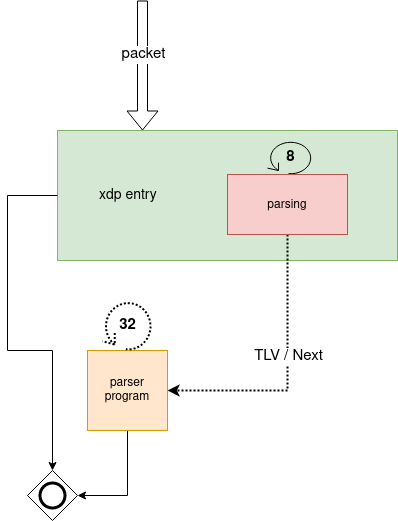

The XDP Target
================

The PANDA compiler is able to generate code that runs on XDP.

The generated code uses the PANDA parser framework as its building blocks,
while still complying to the BPF verifier.

# Architecture



The architecture is split into two BPF programs, represented by the 'xdp entry' box
and the 'parser program' box.

'xdp entry' optimizes the common case, which is nodes without TLVs.

The code in this program parsers up to 8 nodes, handing over the
control to 'parser program' in case it didn't finish parsing or if it
encountered a node with TLVs.

Each dotted line represents a BPF tailcall, which is how we hand control
to 'parser program'.

A node that by the specification has TLVs (eg. TCP), but doesn't declare
them in the parser graph node, will not trigger this behaviour.
Nodes that come after a node with TLVs are always processed in 'parser program'.

In total, the current implementation, can parse up to 40 nodes.
Due to the restrictions imposed by the BPF verifier, it might not be always
possible to parse up to 8 nodes in 'xdp entry'.

# Building applications

In this section we build a simple flow tracker and explain how to integrate
PANDA in your XDP application.

The flowtracker application described here can be built using the sources
[here](../samples/xdp/flow_tracker_simple).


## PANDA Parser

Lets define a 5-tuple parser in `parser.c`.
The parser will extract IPv4 source and destination, protocol and TCP ports.

```C
#include <arpa/inet.h>
#include <linux/types.h>
#include <stdbool.h>
#include <stddef.h>
#include <stdint.h>
#include <stdio.h>
#include <stdlib.h>
#include <string.h>

#include "siphash/siphash.h"

/* Define protocol nodes that are used below */
#include "panda/proto_nodes_def.h"

/* Meta data functions for parser nodes. Use the canned templates
 * for common metadata
 */
PANDA_METADATA_TEMP_ether(ether_metadata, panda_metadata_all)
PANDA_METADATA_TEMP_ipv4(ipv4_metadata, panda_metadata_all)
PANDA_METADATA_TEMP_ports(ports_metadata, panda_metadata_all)

/* Parse nodes. Parse nodes are composed of the common PANDA Parser protocol
 * nodes, metadata functions defined above, and protocol tables defined
 * below
 */

PANDA_MAKE_PARSE_NODE(ether_node, panda_parse_ether, ether_metadata,
                      NULL, ether_table);
PANDA_MAKE_PARSE_NODE(ipv4_check_node, panda_parse_ip,
                      NULL,
                      NULL, ipv4_check_table);
PANDA_MAKE_PARSE_NODE(ipv4_node, panda_parse_ipv4, ipv4_metadata,
                      NULL, ipv4_table);
PANDA_MAKE_LEAF_PARSE_NODE(ports_node, panda_parse_ports, ports_metadata,
                           NULL);

/* Protocol tables */

PANDA_MAKE_PROTO_TABLE(ether_table,
        { __cpu_to_be16(ETH_P_IP), &ipv4_check_node },
);

PANDA_MAKE_PROTO_TABLE(ipv4_check_table,
        { 4, &ipv4_node },
);

PANDA_MAKE_PROTO_TABLE(ipv4_table,
        { IPPROTO_TCP, &ports_node },
        { IPPROTO_UDP, &ports_node },
);

PANDA_PARSER_ADD(panda_parser_simple_tuple, "PANDA parser for 5 tuple TCP/UDP",
                 &ether_node);
```

## Generating the Parser

The compiler will generate BPF-C code when targeting XDP.

```
$ panda-compiler parser.c parser.xdp.h
```

The file `output.xdp.h` contains the generated BPF-C code.
The entry point function is `panda_parser_simple_tuple_panda_parse_ether_node`, in our case.

## Flow tracker

Lets create a toy flow tracker which store flows in a hash map.

In `flowtracker.h`, lets create flow tracker code as follows:

```C
#include <linux/bpf.h>
#include <bpf/bpf_helpers.h>

#include "panda/parser_metadata.h"
#include "panda/bpf.h"

struct flowtuple {
        __be32 saddr;
        __be32 daddr;
        __be16 sport;
        __be16 dport;
        __u8 protocol;
};

struct bpf_elf_map SEC("maps") flowtracker = {
        .type = BPF_MAP_TYPE_HASH,
        .size_key = sizeof(struct flowtuple),
        .size_value = sizeof(__u64),
        .max_elem = 32,
        .pinning = PIN_GLOBAL_NS,
};

__always_inline static void flow_track(struct panda_metadata_all *frame)
{
        struct flowtuple ft = {};
        __u64 new_counter = 1;
        __u64 *counter;

        /* is packet TCP? */
        if (frame->ip_proto != 6)
                return;

        ft.saddr = frame->addrs.v4.saddr;
        ft.daddr = frame->addrs.v4.daddr;
        ft.sport = frame->src_port;
        ft.dport = frame->dst_port;
        ft.protocol = frame->ip_proto;

        counter = bpf_map_lookup_elem(&flowtracker, &ft);
        if (counter) {
                __sync_fetch_and_add(counter, 1);
        } else {
                bpf_map_update_elem(&flowtracker, &ft, &new_counter,
                                    BPF_ANY);
        }
}
```

Note that a more robust implementation should handle the case where our map is full.

## XDP Integration

Parsing is done in two different BPF programs as described in Architecture.
In order to integrate the PANDA parser in our application, we need to account
for BPF tail calls and context passing. The integration should look like the
following.

```C
#include <linux/bpf.h>
#include <bpf/bpf_helpers.h>

#include "flow_tracker.h"
#include "parser.xdp.h"

#define PROG_MAP_ID 0xcafe

struct bpf_elf_map SEC("maps") ctx_map = {
	.type = BPF_MAP_TYPE_PERCPU_ARRAY,
	.size_key = sizeof(__u32),
	.size_value = sizeof(struct panda_ctx),
	.max_elem = 2,
	.pinning = PIN_GLOBAL_NS,
};
struct bpf_elf_map SEC("maps") parsers = {
	.type = BPF_MAP_TYPE_PROG_ARRAY,
	.size_key = sizeof(__u32),
	.size_value = sizeof(__u32),
	.max_elem = 1,
	.pinning = PIN_GLOBAL_NS,
	.id = PROG_MAP_ID,
};

static __always_inline struct panda_ctx *panda_get_ctx(void)
{
	/*
	* clang-10 has a bug if key == 0,
	* it generates bogus bytecodes.
	*/
	__u32 key = 1;
	return bpf_map_lookup_elem(&ctx_map, &key);
}

/* Parser program
 * We might tail call to ourselves up to 32 times
 */
SEC("0xcafe/0")
int parser_prog(struct xdp_md *ctx)
{
	void *data = (void *)(long)ctx->data;
	void *data_end = (void *)(long)ctx->data_end;
	void *original = data;
	int rc = PANDA_OKAY;
	struct panda_ctx *parser_ctx = panda_get_ctx();
	if (!parser_ctx)
		return XDP_ABORTED;
        /* XXX: Invoke the panda parser */
	rc = panda_parser_simple_tuple_panda_parse_ether_node(parser_ctx, (const void **)&data, data_end, true);
	if (rc != PANDA_OKAY && rc != PANDA_STOP_OKAY) {
		bpf_xdp_adjust_head(ctx, -parser_ctx->offset);
		return XDP_PASS;
	}
	if (parser_ctx->next != CODE_IGNORE) {
		parser_ctx->offset += data - original;
		bpf_xdp_adjust_head(ctx, data - original);
		bpf_tail_call(ctx, &parsers, 0);
	}
        /* XXX: Invoke your code here */
        flow_track(parser_ctx->frame);
	bpf_xdp_adjust_head(ctx, -parser_ctx->offset);
	return XDP_PASS;
}

/* XDP entry point
 * The parser might tail call into 'parser_prog'
 */
SEC("prog")
int xdp_prog(struct xdp_md *ctx)
{
	void *data = (void *)(long)ctx->data;
	void *data_end = (void *)(long)ctx->data_end;
	void *original = data;
	int rc = PANDA_OKAY;
	struct panda_ctx *parser_ctx = panda_get_ctx();
	if (!parser_ctx)
		return XDP_ABORTED;
	parser_ctx->metadata.frame_size = sizeof(parser_ctx->frame);
	parser_ctx->metadata.max_frame_num = 0;
	parser_ctx->frame_num = 0;
	parser_ctx->next = CODE_IGNORE;
        /* XXX: Invoke the panda parser */
	rc = panda_parser_simple_tuple_panda_parse_ether_node(parser_ctx, (const void **)&data, data_end, false);
	if (rc != PANDA_OKAY && rc != PANDA_STOP_OKAY) {
		return XDP_PASS;
	}
	if (parser_ctx->next != CODE_IGNORE) {
		parser_ctx->offset = data - original;
		bpf_xdp_adjust_head(ctx, parser_ctx->offset);
		bpf_tail_call(ctx, &parsers, 0);
	}
        /* XXX: Invoke your code here */
        flow_track(parser_ctx->frame);
	return XDP_PASS;
}

char __license[] SEC("license") = "GPL";
```
We write the above code in `flow_tracker.bpf.c`.

## Verifying integration

Lets verify if everything works as expected in our flowtracker application.

```
# Compile to BPF bytecode
$ clang -x c -g -O2 -c flow_tracker.bpf.c -I include/

# Then Load it
$ sudo ip link set dev <device> xdp obj flow_tracker.o verbose
```

Where `<device>` is your network device (example `eno1` etc).

Note that `include/` points to PANDA's `include/` directory.

There are several ways to load a BPF program into XDP.
Using the `ip` program is just one of those ways.

After loading the program, we can then verify the implementation with `bpftool`.

```
$ bpftool map -f
7: hash  flags 0x0
        key 16B  value 8B  max_entries 32  memlock 4096B
        pinned /sys/fs/bpf/tc/globals/flowtracker
8: percpu_array  flags 0x0
        key 4B  value 224B  max_entries 2  memlock 8192B
        pinned /sys/fs/bpf/tc/globals/ctx_map
9: prog_array  flags 0x0
        key 4B  value 4B  max_entries 1  memlock 4096B
        owner_prog_type xdp  owner jited
        pinned /sys/fs/bpf/tc/globals/parsers

# After generating some TCP traffic...

$ sudo bpftool map dump id 7
key: 3f 74 f3 61 c0 a8 01 03  00 50 e5 c0 06 00 00 00  value: 4e 00 00 00 00 00 00 00
Found 1 element
```

The key is the memory dump of our `struct flowtuple` tuple and the
value is the memory dump of our `__u64` counter.

# Unloading

Unload the binary.

**sudo ip link set dev \<device\> xdp off**

Remove the BPF maps.

**sudo rm -rfv /sys/fs/bpf/tc/globals**
